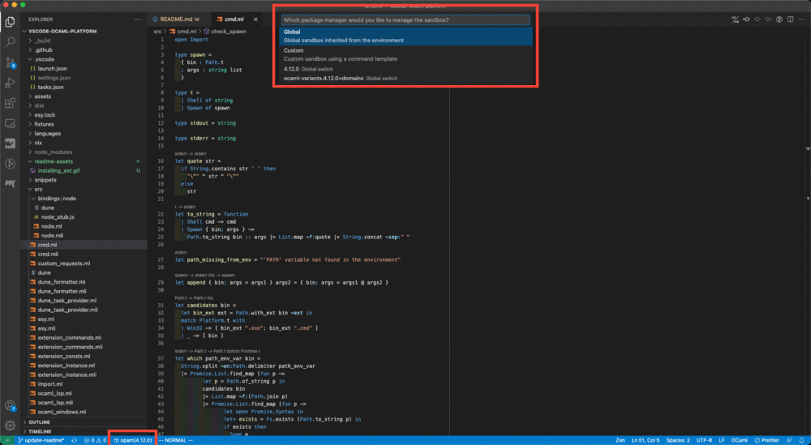
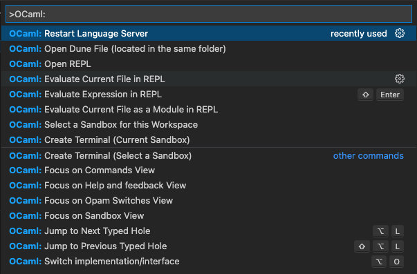
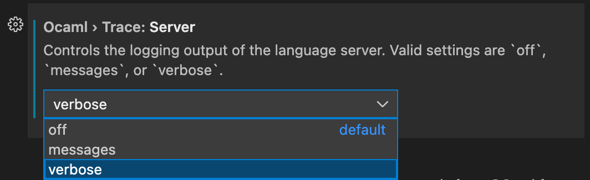

# VSCode OCaml Platform

[](https://github.com/ocamllabs/vscode-ocaml-platform/actions/workflows/main.yml)

| Platform       | Downloads                                                                                                                                                                                           |
| -------------- | --------------------------------------------------------------------------------------------------------------------------------------------------------------------------------------------------- |
| VS Marketplace | [](https://marketplace.visualstudio.com/items?itemName=ocamllabs.ocaml-platform) |
| Open VSX       | [](https://open-vsx.org/extension/ocamllabs/ocaml-platform)                                                       |

Visual Studio Code extension for OCaml and relevant tools.

❗️ You are encouraged to read the [Getting started](#getting-started) section.
The rest of the document assumes you have read it. You may also find
[Important concepts](#important-concepts) useful.

If you have issues with the extension and you have read the "Getting Started"
section, see [Debugging the extension](#debugging-the-extension) and [FAQ](#faq)
below.

## Getting started

### Installation

Below we first install the extension dependencies and then the extension itself.
You can reverse the order; it's just that the extension will not work to its
full without all of its dependencies.

1. Installing extension dependencies

   This VS Code for most of its OCaml language support functionality requires
   OCaml Language Server (often called `ocaml-lsp` or `ocamllsp`). Install
   [ocaml-lsp-server](https://github.com/ocaml/ocaml-lsp) package as usual with
   a package manager of your choice: [OPAM](https://github.com/ocaml/opam) or
   [esy](https://github.com/esy/esy). Installation instructions by package
   manager are available
   [here](https://github.com/ocaml/ocaml-lsp#installation).

   > Make sure to install the packages in the sandbox (usually, OPAM
   > [switch](https://opam.ocaml.org/doc/Usage.html#opam-switch) or esy
   > [sandbox](https://esy.sh/docs/en/getting-started.html)) you use for
   > compiling your project.

   Optionally:

   - Install
     [ocamlformat](https://github.com/ocaml-ppx/ocamlformat#installation)
     package if you want source file formatting support.

     Note: Formatting support requires having `.ocamlformat` file in your
     project root directory.

   - When you hover the cursor over OCaml code, the extension shows you the type
     of the code. Install
     [ocamlformat](https://github.com/ocaml-ppx/ocamlformat#installation) to get
     nicely formatted types.

2. Install this extension from the VSCode
   [Marketplace](https://marketplace.visualstudio.com/items?itemName=ocamllabs.ocaml-platform).
   VSCode extension installations instructions are available
   [here](https://code.visualstudio.com/docs/editor/extension-marketplace).

### Setting up the extension for your project

1. Open your OCaml/ReasonML project (`File > Add Folder to Workspace...`).

2. Configure the extension to use the desired sandbox (usually, OPAM switch or
   esy sandbox). You can pick it by

   - either calling VSCode command "OCaml: Select a Sandbox for this Workspace"
     (one can do this from VSCode Command Palette - <kbd>Ctrl</kbd>+<kbd>P</kbd>
     or on MacOS <kbd>Cmd</kbd>+<kbd>Shift</kbd>+<kbd>P</kbd>)
   - or clicking on the package icon at the bottom of VSCode window and picking
     your sandbox from the menu

     

   > _What's a sandbox?_ In short, the main purpose of a sandbox is to specify
   > how this extension should invoke its dependencies such as
   > `ocaml-lsp-server` or `ocamlformat`. For more information on what a sandbox
   > is, see "Sandbox" subsection.

3. Build your project with [Dune](https://github.com/ocaml/dune) to get
   go-to-definition, auto-completion, etc.

   > Important note: OCaml Language Server has its information about the files
   > from the last time your built your project.

   _Caveat 1:_ Because of the note above, during active development of your
   project, we advise building your project with dune in a polling mode using
   the option `--watch`. This rebuilds your project whenever a file is changed
   in your project. For example, run
   `dune build --watch --terminal-persistence=clear-on-rebuild` in your VSCode
   [integrated terminal](https://code.visualstudio.com/docs/editor/integrated-terminal).

   _Caveat 2:_ Save the currently open file to get latest diagnostics (error and
   warning squiggly underlining). For example, if you created a module `A` in
   some file, and you still get an error that it's "unbound" (i.e., not found)
   in the current file, save the file to get up-to-date diagnostics, assuming
   you built your project after adding `A` or are running build in a polling
   mode, and make sure that error isn't a stale error.

By this point, you should have a working OCaml development editor ready.

### Dune Package Management (DPM)

This extension now supports **Dune Package Management (DPM)** as a sandbox for
your OCaml projects.

DPM becomes available when your system has:

- **Dune version ≥ 3.20.0**, or
- A **Dune preview build dated 2025-07-30 or later**.

A final required feature was implemented on **2025-07-29**, enabling full
support for Dune development tools (`dune lock`, `dune tools exec`, and tools
like `ocamlformat`) inside the `ocamllsp` sandbox environment.

#### Automatic Detection

When a compatible Dune version is detected:

- The extension automatically recognizes that your environment supports DPM.
- A popup notification informs you that **Dune Package Management is
  available**.
- If your project is **not yet locked**, the extension will prompt you to lock
  the project.

- Once the project is locked, the extension will automatically configure
  `ocamllsp` to use the DPM sandbox.

#### Using Dune Package Management

To manually enable DPM for your project at any time:

1. Open your OCaml project in VSCode.
2. In the status bar (bottom-right), click the **sandbox selector**.
3. Choose **“Dune Package Management”** from the list of available sandboxes.

The extension then configures `ocamllsp` to run inside the DPM sandbox, ensuring
that all Dune dev tools are available in the sandboxed `PATH`.

### ReasonML / ReScript / BuckleScript

ReasonML, as an alternative syntax for OCaml, is supported out-of-the-box, as
long as `reason` is installed in your environment.

The new ReScript syntax (`res` and `resi` files) is not supported, you should
use [rescript-vscode](https://github.com/rescript-lang/rescript-vscode) instead.

If you're looking for a way to use OCaml or ReasonML syntax in a ReScript
project, it is no longer supported by this extension.

If you need to compile existing OCaml or ReasonML syntax to JS and use this
extension, you can use [Melange](https://github.com/melange-re/melange):

1. Install esy

```bash
npm install esy --global
```

2. You can use the
   [Melange basic template](https://github.com/melange-re/melange-basic-template)
   to add OCaml LSP support. Then modify esy.json to pin ocaml-lsp-server to
   version 1.8.3 due to lack of Merlin support in newer versions.

```json
{
  "dependencies": {
    "@opam/ocaml-lsp-server": "1.8.3"
  }
}
```

3. Install and build packages

```bash
esy
```

## Important Concepts

### Sandbox

Sandbox defines environment that the extension sees, for example, to launch
`ocamllsp`, detect OCaml compiler version, or use `ocamlformat`.

The extension supports 4 kinds of sandboxes:

1. Global

The extension uses the environment that VS Code was opened in.

2. OPAM Sandbox

The extension uses the environment defined by the OPAM switch that the user
picks. Both global and local OPAM switches are supported.

3. Esy Sandbox

The extension uses the environment defined by the Esy sandbox that the user
picks.

4. Custom

User can define how they would like to run commands using a (templated) command
where `$prog` and `$args` strings need to be used to denote how to run an
extension dependency and how arguments can be passed. One can imitate an OPAM
sandbox using a custom sandbox by passing a command
`opam exec --switch=4.13.1 --set-switch -- $prog $args` -- the extension can
then replace `$prog` with `ocamllsp` and `$args` with arguments it wants to pass
to `ocamllsp`.

## Features

- Syntax highlighting
  - ATD
  - Cram tests
  - Dune
  - Menhir
  - Merlin
  - META
  - OASIS
  - OCaml
  - OCamlbuild
  - OCamlFormat
  - OCamllex
  - opam
  - ReasonML
  - Eliom
- Indentation rules
- Snippets
  - Dune
  - OCaml
  - OCamllex
- Task Provider
  - Dune
- Debugger
  - Earlybird (experimental)

## Configuration

This extension provides options in VSCode's configuration settings. You can find
the settings under `File > Preferences > Settings`.

| Name                                      | Description                                                                                             | Default |
| ----------------------------------------- | ------------------------------------------------------------------------------------------------------- | ------- |
| `ocaml.sandbox`                           | Determines where to find the sandbox for a given project                                                | `null`  |
| `ocaml.dune.autoDetect`                   | Controls whether dune tasks should be automatically detected.                                           | `true`  |
| `ocaml.trace.server`                      | Controls the logging output of the language server. Valid settings are `off`, `messages`, or `verbose`. | `off`   |
| `ocaml.useOcamlEnv`                       | Controls whether to use ocaml-env (if available) for opam commands from OCaml for Windows.              | `true`  |
| `ocaml.terminal.shell.linux`              | The path of the shell that the sandbox terminal uses on Linux                                           | `null`  |
| `ocaml.terminal.shell.osx`                | The path of the shell that the sandbox terminal uses on macOS                                           | `null`  |
| `ocaml.terminal.shell.windows`            | The path of the shell that the sandbox terminal uses on Windows                                         | `null`  |
| `ocaml.terminal.shellArgs.linux`          | The command line arguments that the sandbox terminal uses on Linux                                      | `null`  |
| `ocaml.terminal.shellArgs.osx`            | The command line arguments that the sandbox terminal uses on macOS                                      | `null`  |
| `ocaml.terminal.shellArgs.windows`        | The command line arguments that the sandbox terminal uses on Windows                                    | `null`  |
| `ocaml.repl.path`                         | The path of the REPL that the extension uses                                                            | `null`  |
| `ocaml.repl.args`                         | The REPL arguments that the extension uses                                                              | `null`  |
| `ocaml.repl.useUtop`                      | Controls whether to use Utop for the REPL if it is installed in the current switch.                     | `true`  |
| `ocaml.commands.construct.recursiveCalls` | When enabled, the construct command will execute again on the next hole after a value has been chosen.  | `true`  |

If `ocaml.terminal.shell.*` or `ocaml.terminal.shellArgs.*` is `null`, the
configured VSCode shell and shell arguments will be used instead.

If `ocaml.repl.path` or `ocaml.repl.args` is `null`, the default REPL is used
instead. The default REPL used depends on the packages installed in your current
sandbox:

- If `dune build` passes and the current sandbox has `utop` installed, the REPL
  will be `dune utop`
- If `dune build` fails and the current sandbox has `utop` installed, the REPL
  will be `utop`
- Else, the REPL will be `ocaml`

If a REPL already exists, it will be used instead, so if you installed `utop`
after openning a REPL, or if you fixed your project compilation, you will need
to re-open the REPL to change it.

## Commands

An easy way to see what commands are offered by the extension in the currently
open file, you can invoke VSCode Command Palette and search for commands with
prefix `OCaml:`:



| Name                           | Description                                 | Keyboard Shortcuts |
| ------------------------------ | ------------------------------------------- | ------------------ |
| `ocaml.select-sandbox`         | Select sandbox for this workspace           |                    |
| `ocaml.server.restart`         | Restart language server                     |                    |
| `ocaml.open-terminal`          | Open a terminal (current sandbox)           |                    |
| `ocaml.open-terminal-select`   | Open a terminal (select a sandbox)          |                    |
| `ocaml.current-dune-file`      | Open Dune File (located in the same folder) |                    |
| `ocaml.switch-impl-intf`       | Switch implementation/interface             | `Alt+O`            |
| `ocaml.open-repl`              | Open REPL                                   |                    |
| `ocaml.evaluate-selection`     | Evaluate Selection                          | `Shift+Enter`      |
| `ocaml.copy-type-under-cursor` | Copy the type under the cursor              |                    |
| `ocaml.search-by-type`         | Search a value by type or polarity          | `Alt+F`            |

## Debugging OCaml programs (experimental)

Experimental support for debugging OCaml programs is provided via
[earlybird](https://github.com/hackwaly/ocamlearlybird). Problems with the
debugger should be reported at <https://github.com/hackwaly/ocamlearlybird>.

Two steps to set up debugging:

1. Install [earlybird](https://opam.ocaml.org/packages/earlybird/), which
   provides the `ocamlearlybird` executable.

   For newer OCaml version support, opam pin the development version from
   <https://github.com/hackwaly/ocamlearlybird>.

2. If you use `dune` language version 3.0+ to build your project, switch to 3.7+
   and make sure that you add:

   ```
   (map_workspace_root false)
   ```

   to your `dune-project` file. More info on this
   [here](https://dune.readthedocs.io/en/stable/reference/dune-project/map_workspace_root.html).

3. Build _bytecode_ version of your OCaml program executable.

   See
   [dune documentation](https://dune.readthedocs.io/en/stable/quick-start.html#building-a-hello-world-program-in-bytecode)
   for further information.

There are three ways to launch the debugger in VS Code:

1. Navigate to the built OCaml bytecode executable in VS Code Explorer panel (a
   `.bc` file in `_build` directory), right click on it and select "Start OCaml
   Debugging (experimental)".

   The debugger launches immediately.

2. If no VS Code launch configurations (the `.vscode/launch.json` file) exist,
   then navigate to VS Code Run and Debug panel, click on "create a launch.json
   file" and select "OCaml earlybird (experimental)".

   Run the created "OCaml earlybird (experimental)" launch configuration to
   launch the debugger. By default, it asks to open an OCaml bytecode executable
   (a `.bc` file in `_build` directory) to debug. You can hard-code a specific
   program instead of the default `${command:AskProgram}`.

3. If some VS Code launch configurations exist (in `.vscode/launch.json`), then
   open the `launch.json` file and inside `configurations` press Ctrl+Space to
   select the "OCaml earlybird (experimental)" snippet. Then fill in the OCaml
   bytecode executable path and desired launch configuration name.

   Run the created launch configuration to launch the debugger.

## Debugging the extension

### Problems with code or file formatting support

If you are experiencing problems with OCaml code support, e.g., you invoke
`Go to Definition` on a symbol (for example, a variable name), but nothing
happens, or you hover the cursor over a symbol and don't see its type, the
problem is likely to be with OCaml-LSP, which is responsible for code support.

Two steps to see if there are reported problems with OCaml-LSP (which you can
either act upon yourself if you can or report the problem in Issues/Discussion
of this repository):

1. Set the `ocaml.trace.server` setting to `verbose` in VS Code settings.



2. Invoke command `OCaml: Show OCaml Language Server Output` from the VS Code
   Command Palette. This command shows requests and responses exchanged between
   this extension and OCaml-LSP. If, for example, `Go to Definition` is not
   working when you think it should, you may see some exception logged in this
   Output View:

   ```
   [Error - 10:41:51 PM] Locate failed. File_not_found: 'Fiber' seems to originate from 'Fiber' whose ML file could not be found
   ```

   You can also sometimes see explicitly an exception being thrown. Such kind of
   information in an issue report is usually very helpful in detecting and
   fixing the problem.

If you face such kind of problems that you cannot resolve on your own, please,
check that the issue hasn't been reported yet and report in
[Issues](https://github.com/ocaml/ocaml-lsp/issues) if necessary.

Note: File formatting is performed on the OCaml-LSP side, so OCaml-LSP may be
the culprit in a formatting problem. Make sure, however, that you've read
[Getting Started](#getting-started) section, which describes some initial setup
required for file formatting to work.

### Problems with this Extension or OPAM support in the Extension

One by one, invoke and see outputs for commands
`OCaml: Show OCaml Platform Extension Output` and
`OCaml: Show OCaml Commands Output`. In these Output Views you may see errors
and warnings, which can be handy to detect and fix the problem you're facing.
Please, check the issue you're facing hasn't been already reported and report in
[Issues](https://github.com/ocamllabs/vscode-ocaml-platform/issues) tab of this
repository, if necessary.

### Things to include in your Issue report

It is helpful to include information such as

- Operation system information
- VS Code version
- OCaml Platform Extension version
- OCaml-LSP version
- Reproducible setup (some codebase, for example, where we can see the bug
  happening) the problem
- Output View information described above

## FAQ

<details>
<summary>I installed <code>ocaml-lsp-server</code>, but the extension still cannot find it.</summary>

Make sure you installed the the language server in the sandbox used by the
extension.

_OPAM_: If you're using opam, make sure that you're using correct switch when
installing the extension by running `opam switch` to see the current switch and
check the sandbox set for the current VSCode workspace (see "Setting up the
extension for your project" section to learn more about picking a sandbox for
the extension).

</details>

<details>
<summary> I am getting <code>Unbound module ...</code> error. What should I do? </summary>

1. Make sure the module _should_ be visible, e.g., there is no typo in the
   module name, you added the module to `libraries` stanza in your `dune` file,
   etc.

2. Make sure you have up-to-date diagnostics (error and warning squiggly
   underlining). Diagnostics are sent when the file open, when file is edited,
   and when it is saved. Save the file containing the error to make sure the
   error isn't stale.

3. Make sure you have built your project after adding that module to your
   environment. We suggest adhering to _Caveat 1_ in "Setting up the extension
   for your project" section. If you haven't built it, build it and go to
   step 2.

4. If you are sure there must be a problem with the extension, file an issue.

</details>

In case you have a question or problem not listed above:

- if you don't understand how to the extension works or how to make it work
  correctly, create a new discussion in the repository Discussions
  [tab](https://github.com/ocamllabs/vscode-ocaml-platform/discussions).

- if the extension seems to misbehave:
  - see [Debugging](#debugging) section to see if you can see any reported
    errors
  - file an issue in the repository Issues
    [tab](https://github.com/ocamllabs/vscode-ocaml-platform/issues).

If this section doesn't contain the problem you managed to resolve, and you
think this may help others, consider adding the problem and its solution here by
creating a Pull Request.

## For advanced users

This part of README is only for advanced users, who would like more
customization.

### Disable code lens

Code lens are type information displayed over a symbol. In the screenshot below,
code lens is grey text `t -> Sandbox.t`.


You can disable code lens for all extensions, i.e., in whole VS Code, set this
settings in your `settings.json`:

```json
  "editor.codeLens": false
```

Or if you only want to disable it for OCaml:

```json
"[ocaml]": {
	"editor.codeLens": false
}
```

You can also search for "code lens" in the VSCode settings tab and there will be
a checkbox you can untick to disable it:


(Credit for this answer goes to @mnxn)

### Enable only syntax highlighting (No type-on-hover, go-to-definition, etc.)

The extension does not offer such functionality because it is rarely necessary.
A workaround is to _not_ install `ocamllsp`. As a result you will mostly have
just syntax highlighting for OCaml source files but also a warning notification
that `ocamllsp` wasn't found. See this
[issue](https://github.com/ocamllabs/vscode-ocaml-platform/issues/889), feel
free to upvote this issue by leaving a thumbs-up reaction. Pull requests are
welcome as well.

### Persisting sandbox information

Sandbox information is persisted in `.vscode/settings.json`. Below we show how
this settings file's content may look like with different sandbox options.

1. Global

```json
{
  "ocaml.sandbox": {
    "kind": "global"
  }
}
```

2. OPAM

_Global switch_

```json
{
  "ocaml.sandbox": {
    "kind": "opam",
    "switch": "ocaml-base-compiler.4.13.1"
  }
}
```

_Local switch_

```json
{
  "ocaml.sandbox": {
    "kind": "opam",
    "switch": "/Users/ulugbekna/code/olsp"
  }
}
```

3. Esy

```json
{
  "ocaml.sandbox": {
    "kind": "esy",
    "root": "${firstWorkspaceFolder}"
  }
}
```

4. Custom

```json
{
  "ocaml.sandbox": {
    "kind": "custom",
    "template": "opam exec -- $prog $args"
  }
}
```
